# Boolean Arithmetic and the ALU

## Binary Numbers

- Machine language is represented by 0 and 1. Follows by the **N-bits or 2^N possibilities**. 
- Most significant bits is represented on the leftmost of the binary representation. Least significant follows through the rightmost.

| Decimal | Binary (4-bits) |
| ------- | --------------- |
| 0       | 0000            |
| 2       | 0010            |
| 4       | 0100            |
| 7       | 0111            |
- Example: Binary representation of 99
	- Start with the highest leftmost bits and go down the sum.
	- 01100011
	- 64 + 32 + 2 + 1 = 99
	- 2^6 + 2^5 + 2^1 + 2^0 = 99 

## Binary Addition
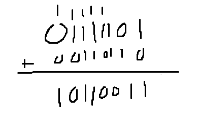
- Similar to adding math in elementary, but instead the max is one. 
- 01111101 + 00110110 = 10110011

### Occurence of Overflow
- There might be a situation where the operation of the binary digit will bypass the limited sizes of the bits, which is called overflow. 
	- If this happens, the one that is carry over the bit. It is either ignored or will crash the program.
- 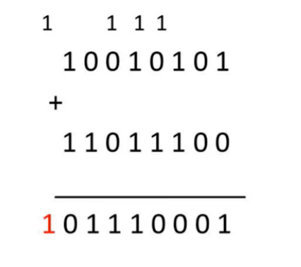

### Half Adder
- **Half Adder**: Able to add two 1-bit inputs and produce a sum and carry-out. However, there no process to compute the carry. Thus, called a Half-Adder.
- 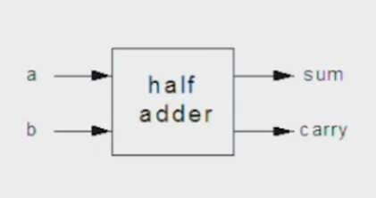
```
CHIP HalfAdder {
    IN a, b;    // 1-bit inputs
    OUT sum,    // Right bit of a + b 
        carry;  // Left bit of a + b

    PARTS:
    //// Replace this comment with your code.
    Xor(a = a, b = b, out = sum);
    And(a= a, b= b, out= carry);
}
```
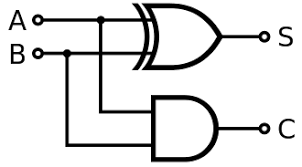

| a   | b   | sum | carry |
| --- | --- | --- | ----- |
| 0   | 0   | 0   | 0     |
| 0   | 1   | 1   | 0     |
| 1   | 0   | 1   | 0     |
| 1   | 1   | 0   | 1     |

Implementation: **Don't over think, it is straightforward with two separate outputs.**

### Full Adder
- **Full-Adder**: Using the Carry result from the Half-Adder, we can use the result into the Carry-In input to process the full calculation of binary addition. 
- 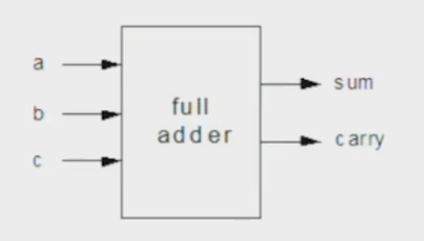
```
CHIP FullAdder {
    IN a, b, c;  // 1-bit inputs
    OUT sum,     // Right bit of a + b + c
        carry;   // Left bit of a + b + c

    PARTS:
    //// Replace this comment with your code.
    Xor(a = a, b = b, out = w1);
    Xor(a = c, b = w1, out = sum);
    And(a= a, b= b, out= x1);
    And(a=c , b= w1, out= x2);
    Or(a=x1 , b= x2, out= carry);
}
```
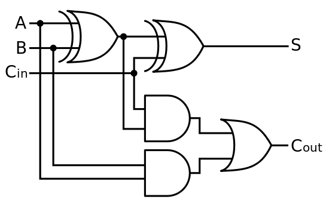

| a   | b   | Carry-In | sum | Carry-Out |
| --- | --- | -------- | --- | --------- |
| 0   | 0   | 0        | 0   | 0         |
| 0   | 0   | 1        | 1   | 0         |
| 0   | 1   | 0        | 1   | 0         |
| 0   | 1   | 1        | 0   | 1         |
| 1   | 0   | 0        | 1   | 0         |
| 1   | 0   | 1        | 0   | 1         |
| 1   | 1   | 0        | 0   | 1         |
| 1   | 1   | 1        | 1   | 1         |

### Multi-bits Adder
- **Multi-bits Adder**: Adds two numbers
- With the combination of full-adders and one half-adder, to represent the lower significant bit, we can sum multiple bits as a result. Overflow are ignored, if exceed the bits size of the memory.
- 2-bits Adder will composed of a half-adder and a full-adder. 
- 4-bits Adder: Half-Adder represent the lower-significant bit (first-bit). We can use that carry result to compute other full-adders for correctly calculating binary sums. 
- 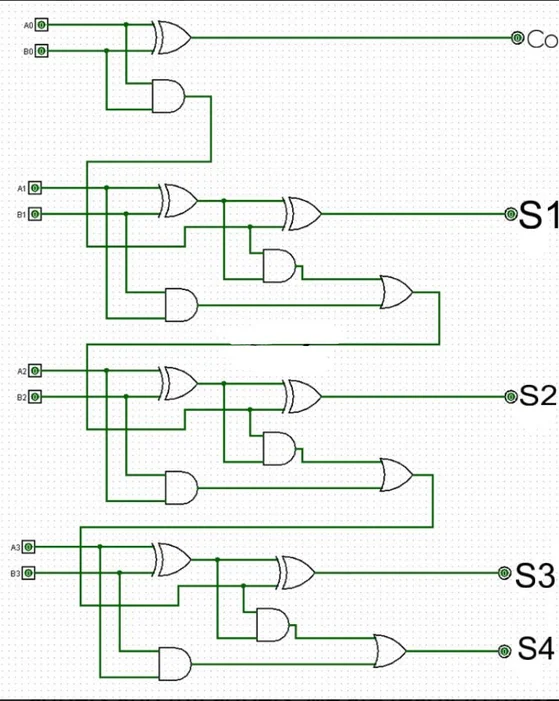
- 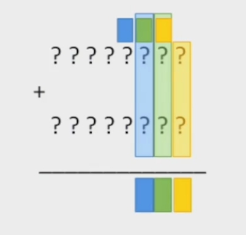

## Negative Numbers

### Sign Bit
- In the earliest consideration of time to represent negative numbers in binary, the first form was using Sign-bit. Essentially, the first bit, on the leftmost, is -/+ where - is followed by a 1. **Was later scraped due to complication**.
- As you can see in the table below, there are many complications including -0 and many edge cases that make it difficult to follow and even consider being used in computer hardware. Even -3, in this case, is hard to follow.

| 000 | 0   |
| --- | --- |
| 001 | 1   |
| 010 | 2   |
| 011 | 3   |
| 100 | -0  |
| 101 | -1  |
| 110 | -2  |
| 111 | -3  |
### 2's Complement
- This form called 2's complement was introduced later and it is currently used by all modern devices today to represent fixed point values from negative to positive numbers. Essentially, starting from the leftmost bit, 1 is for negative number and 0 is for positive. **Any overflowing binary will be represented by 1 for negative number**. 

| 000 | 0   |
| --- | --- |
| 001 | 1   |
| 010 | 2   |
| 011 | 3   |
| 100 | -4  |
| 101 | -3  |
| 110 | -2  |
| 111 | -1  |

- Two methods of determining the negative number of the binary...
	- Inverse Process (use more commonly for larger numbers):
		- Subtract 1 -> 1111 - 1 = 1110
		- Invert all bits -> 0001
		- Using standard binary notation -> 0001 = 1
		- Then add the negative sign -> -1
	- Reading it directly...
		- Take the leftmost bit and assign it negative -> 1111 -> -2^3 = -8
		- Use the other bits as positive numbers -> 4, 2, 1
		- -8 + 4 + 2 + 1 = -1 -> As a result, our negative number of our binary is -1. 
- Determine the binary of a given negative number...
	- Opposite of the inverse process (for example, let's do -5)...
		- Find the binary of the positive value: 5 -> 0101
		- Invert all bits -> 1010
		- Add 1 -> 1011
		- **1011** = -5
### Addition in 2's Compliments

- 4-bits 2's Compliment example: 7 + (-5) = 2
	- 7 -> 0111
	- -5 -> 1011
	- 0111 + 1011 -> 10010
	- Ignoring the overflow -> **0010**
	- 0010 -> 2

### Computer Representation

- To represent negative binary numbers within a computer hardware, we need to essentially make a tradeoff because every computer can only handle certain limitation of memory.
	- For example, unsigned integer is (2^32 - 1) bits which is 0 -> 4,294,967,295. 
	- As a result, it will end taking the range of -(2^31) to (2^31 - 1) bits to represent -2,147,483,648 to 2,147,483,647.

## Arithmetic Logic Unit

- Every general-purpose computer consist of this component within their CPU, which is called the **Arithmetic Logic Unit**. Here is an overview of a general computer system, **Von Neumann Architecture**. 
- 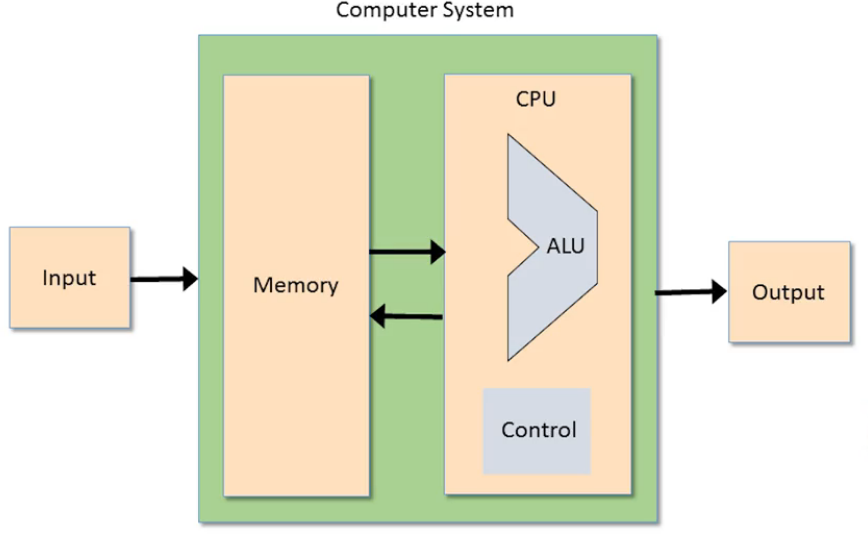
- The Arithmetic Logic Unit (**ALU**) is the main computational power of the CPU that handles the arithmetic (integer, addition, multiplication, division, etc...) and logical (AND, OR, XOR, etc...) operations for the computer. 
	- Implementation Question: Which operations should the ALU perform?
		- Depends on the hardware/software tradeoff, what it needs to be able to handle, business decision, and requirements.
- ALU computes a function with two inputs that output a result. *f* is the input for which determines the opcode or predefined arithmetic or logical operation is needed.
- 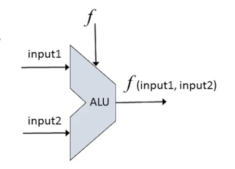

### The Hack ALU

- An ALU that operates on two 16-bits inputs that is able to do 2's complement computation and output certain operations.
- Above the ALU, we called those **opcode** or control bits, the input of those control bits determine which arithmetic or logical operations to do. 
- 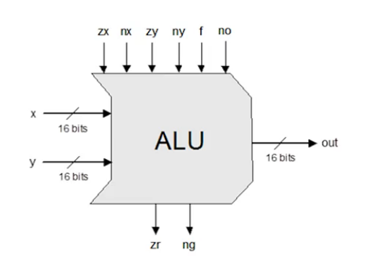

| Out  |
| ---- |
| 0    |
| 1    |
| -1   |
| x    |
| y    |
| !x   |
| !y   |
| -x   |
| -y   |
| x+1  |
| y+1  |
| x-1  |
| y-1  |
| x+y  |
| x-y  |
| y-x  |
| x&y  |
| x\|y |

### ALU operations based on the inputs of the opcode...
- 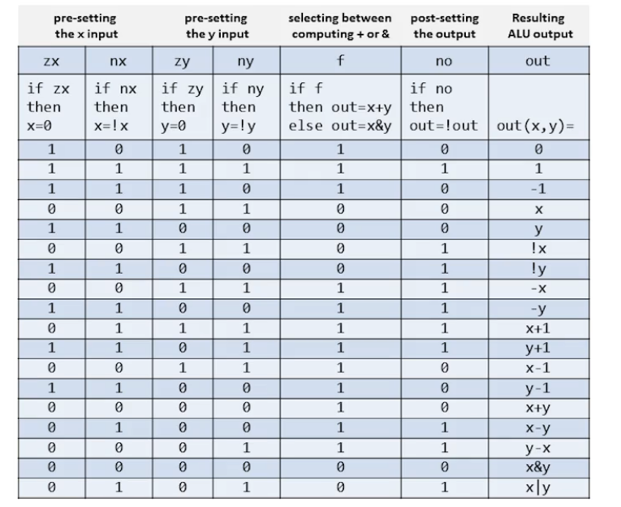
- Example: Compute y-x when x = 0010, y = 0111
	- Starting from zx, input bit is 0. Therefore, **x will stay 0010**.
	- Then on nx, input bit is 0. **X will stay 0010**.
	- Moving the y-input, zy's input bit is 0. Therefore, **y will stay 0111**.
	- Then on ny, input bit is 1. **y will flip and become 1000**.
	- Then onto *f*, input bit is 1. We will do x+y operation. **1010**
	- Lastly on no, input bit is also one. Flipping it, becomes **0101**.
- You can confirm the answer of the ALU process is correct with the binary subtraction done by hand. 
- Brainstorm question: We have 6 control bits. The ALU can compute up to 2^6 or 64 possible operations (functions). What do expect the resulting function be when zx=1, nx=0, zy=1, ny=1, f=1, and no=1?
	- Tip: Ignore what the inputs are and focused on the control bits inputs. Go through the operation.
	- zx=1, x -> 0000000... and nx=0 -> 000000...
	- zy=1, y -> 0000000... and ny=1 -> 111111...
	- f=1, x&y and no=1 -> 000000..
	- Therefore everything becomes 0.

## 16-bits Adder
- 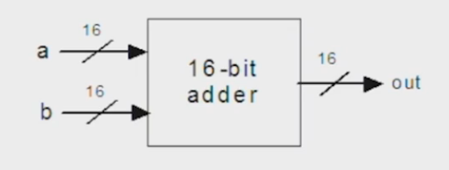
```
CHIP Add16 {
    IN a[16], b[16];
    OUT out[16];

    PARTS:
    //// Replace this comment with your code.
    HalfAdder(a= a[0], b= b[0], sum= out[0], carry= c0);
    FullAdder(a= a[1], b= b[1], c= c0, sum= out[1], carry= c1);
    FullAdder(a= a[2], b= b[2], c= c1, sum= out[2], carry= c2);
    FullAdder(a= a[3], b= b[3], c= c2, sum= out[3], carry= c3);
    FullAdder(a= a[4], b= b[4], c= c3, sum= out[4], carry= c4);
    FullAdder(a= a[5], b= b[5], c= c4, sum= out[5], carry= c5);
    FullAdder(a= a[6], b= b[6], c= c5, sum= out[6], carry= c6);
    FullAdder(a= a[7], b= b[7], c= c6, sum= out[7], carry= c7);
    FullAdder(a= a[8], b= b[8], c= c7, sum= out[8], carry= c8);
    FullAdder(a= a[9], b= b[9], c= c8, sum= out[9], carry= c9);
    FullAdder(a= a[10], b= b[10], c= c9, sum= out[10], carry= c10);
    FullAdder(a= a[11], b= b[11], c= c10, sum= out[11], carry= c11);
    FullAdder(a= a[12], b= b[12], c= c11, sum= out[12], carry= c12);
    FullAdder(a= a[13], b= b[13], c= c12, sum= out[13], carry= c13);
    FullAdder(a= a[14], b= b[14], c= c13, sum= out[14], carry= c14);
    FullAdder(a= a[15], b= b[15], c= c14, sum= out[15], carry= drop);
}
```

| a                | b                | out              |
| ---------------- | ---------------- | ---------------- |
| 0000000000000000 | 0000000000000000 | 0000000000000000 |
| 0000000000000000 | 1111111111111111 | 1111111111111111 |
| 1111111111111111 | 1111111111111111 | 1111111111111110 |
| 1010101010101010 | 0101010101010101 | 1111111111111111 |
| 0011110011000011 | 0000111111110000 | 0100110010110011 |
| 0001001000110100 | 1001100001110110 | 1010101010101010 |
Tips: **Remember that a 2-bits adder compromise of an half adder (for the least significant bits) and a full adder (for higher significant bits)**. Following that patterns, composes it into a 16-bits adder. Don't overthink.

## 16-bits Incrementor
- 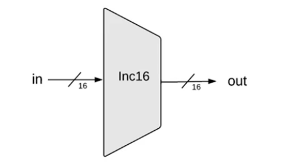
```
/**
 * 16-bit incrementer:
 * out = in + 1
 */

CHIP Inc16 {
    IN in[16];
    OUT out[16];

    PARTS:
    //// Replace this comment with your code.
    Add16(a = in, b[0] = true, out = out);
}
```

| In               | Out              |
| ---------------- | ---------------- |
| 0000000000000000 | 0000000000000001 |
| 1111111111111111 | 0000000000000000 |
| 0000000000000101 | 0000000000000110 |
| 1111111111111011 | 1111111111111100 |
Tips: **Don't overthink, it was very straightforward**. It is just an input plus 1 (1-bit). Shorten way is above for HDL. In other cases, it may be a 16-bits Adder, but the second input of least significant bit is true while the rest is false. So, b[0] = 1, while b[1...15] = 0.

## ALU
- 
```
/**
 * ALU (Arithmetic Logic Unit):
 * Computes out = one of the following functions:
 *                0, 1, -1,
 *                x, y, !x, !y, -x, -y,
 *                x + 1, y + 1, x - 1, y - 1,
 *                x + y, x - y, y - x,
 *                x & y, x | y
 * on the 16-bit inputs x, y,
 * according to the input bits zx, nx, zy, ny, f, no.
 * In addition, computes the two output bits:
 * if (out == 0) zr = 1, else zr = 0
 * if (out < 0)  ng = 1, else ng = 0
 */
// Implementation: Manipulates the x and y inputs
// and operates on the resulting values, as follows:
// if (zx == 1) sets x = 0        // 16-bit constant
// if (nx == 1) sets x = !x       // bitwise not
// if (zy == 1) sets y = 0        // 16-bit constant
// if (ny == 1) sets y = !y       // bitwise not
// if (f == 1)  sets out = x + y  // integer 2's complement addition
// if (f == 0)  sets out = x & y  // bitwise and
// if (no == 1) sets out = !out   // bitwise not

CHIP ALU {
    IN  
        x[16], y[16],  // 16-bit inputs        
        zx, // zero the x input?
        nx, // negate the x input?
        zy, // zero the y input?
        ny, // negate the y input?
        f,  // compute (out = x + y) or (out = x & y)?
        no; // negate the out output?
    OUT 
        out[16], // 16-bit output
        zr,      // if (out == 0) equals 1, else 0
        ng;      // if (out < 0)  equals 1, else 0

    PARTS:
    // X's Input
    Mux16(a=x, b=false, sel=zx, out=zdx); // Set X to 0.
    Not16(in=zdx, out=notx); // Helper for choosing x or notx
    Mux16(a=zdx, b=notx, sel=nx, out=ndx); // Choose between x or notx

    // Y's Input
    Mux16(a=y, b=false, sel=zy, out=zdy);
    Not16(in=zdy, out=noty);
    Mux16(a=zdy, b=noty, sel=ny, out=ndy);

    // f
    Add16(a=ndx, b=ndy, out=fadd); // Seperate two functions
    And16(a=ndx, b=ndy, out=fand);
    Mux16(a=fand, b=fadd, sel=f, out=fout); // Use mux as a selector

    // no 
    Not16(in=fout, out=fnotout);
    Mux16(a=fout, b=fnotout, sel=no, out=out, out[0..7]=out0to7, out[8..15]=out8to15, out[15]=ng);

    // zr
    Or8Way(in=out0to7, out=orway1);
    Or8Way(in=out8to15, out=orway2);
    Or(a=orway1, b=orway2, out=orway);
    Not(in=orway, out=zr);
}
```
### Control Bits
- **zx**: Zero the x input
- **nx**: Negate the x input
- **zy**: Zero the y input
- **ny**: Negate the y input
- **f**: Function select (1 for add, 0 for and)
- **no**: Negate the output

### Truth Table

| x Input          | y Input          | zx | nx | zy | ny | f  | no | Output           | zr | ng |
|------------------|------------------|----|----|----|----|----|----|------------------|----|----|
| 0000000000000000 | 1111111111111111 | 1  | 0  | 1  | 0  | 1  | 0  | 0000000000000000 | 1  | 0  |
| 0000000000000000 | 1111111111111111 | 1  | 1  | 1  | 1  | 1  | 1  | 0000000000000001 | 0  | 0  |
| 0000000000000000 | 1111111111111111 | 1  | 1  | 1  | 0  | 1  | 0  | 1111111111111111 | 0  | 1  |
| 0000000000000000 | 1111111111111111 | 0  | 0  | 1  | 1  | 0  | 0  | 0000000000000000 | 1  | 0  |
| 0000000000000000 | 1111111111111111 | 1  | 1  | 0  | 0  | 0  | 0  | 1111111111111111 | 0  | 1  |
| 0000000000000000 | 1111111111111111 | 0  | 0  | 1  | 1  | 0  | 1  | 1111111111111111 | 0  | 1  |
| 0000000000000000 | 1111111111111111 | 1  | 1  | 0  | 0  | 0  | 1  | 0000000000000000 | 1  | 0  |
| 0000000000000000 | 1111111111111111 | 0  | 0  | 1  | 1  | 1  | 1  | 0000000000000000 | 1  | 0  |
| 0000000000000000 | 1111111111111111 | 1  | 1  | 0  | 0  | 1  | 1  | 0000000000000001 | 0  | 0  |
| 0000000000000000 | 1111111111111111 | 0  | 1  | 1  | 1  | 1  | 1  | 0000000000000001 | 0  | 0  |
| 0000000000000000 | 1111111111111111 | 1  | 1  | 0  | 1  | 1  | 1  | 0000000000000000 | 1  | 0  |
| 0000000000000000 | 1111111111111111 | 0  | 0  | 1  | 1  | 1  | 0  | 1111111111111111 | 0  | 1  |
| 0000000000000000 | 1111111111111111 | 1  | 1  | 0  | 0  | 1  | 0  | 1111111111111110 | 0  | 1  |
| 0000000000000000 | 1111111111111111 | 0  | 0  | 0  | 0  | 1  | 0  | 1111111111111111 | 0  | 1  |
| 0000000000000000 | 1111111111111111 | 0  | 1  | 0  | 0  | 1  | 1  | 0000000000000001 | 0  | 0  |
| 0000000000000000 | 1111111111111111 | 0  | 0  | 0  | 1  | 1  | 1  | 1111111111111111 | 0  | 1  |
| 0000000000000000 | 1111111111111111 | 0  | 0  | 0  | 0  | 0  | 0  | 0000000000000000 | 1  | 0  |
| 0000000000000000 | 1111111111111111 | 0  | 1  | 0  | 1  | 0  | 1  | 1111111111111111 | 0  | 1  |

### With Non-Zero Values

| x Input          | y Input          | zx | nx | zy | ny | f  | no | Output           | zr | ng |
|------------------|------------------|----|----|----|----|----|----|------------------|----|----|
| 0000000000010001 | 0000000000000011 | 1  | 0  | 1  | 0  | 1  | 0  | 0000000000000000 | 1  | 0  |
| 0000000000010001 | 0000000000000011 | 1  | 1  | 1  | 1  | 1  | 1  | 0000000000000001 | 0  | 0  |
| 0000000000010001 | 0000000000000011 | 1  | 1  | 1  | 0  | 1  | 0  | 1111111111111111 | 0  | 1  |
| 0000000000010001 | 0000000000000011 | 0  | 0  | 1  | 1  | 0  | 0  | 0000000000010001 | 0  | 0  |
| 0000000000010001 | 0000000000000011 | 1  | 1  | 0  | 0  | 0  | 0  | 0000000000000011 | 0  | 0  |
| 0000000000010001 | 0000000000000011 | 0  | 0  | 1  | 1  | 0  | 1  | 1111111111101110 | 0  | 1  |
| 0000000000010001 | 0000000000000011 | 1  | 1  | 0  | 0  | 0  | 1  | 1111111111111100 | 0  | 1  |
| 0000000000010001 | 0000000000000011 | 0  | 0  | 1  | 1  | 1  | 1  | 1111111111101111 | 0  | 1  |
| 0000000000010001 | 0000000000000011 | 1  | 1  | 0  | 0  | 1  | 1  | 1111111111111101 | 0  | 1  |
| 0000000000010001 | 0000000000000011 | 0  | 1  | 1  | 1  | 1  | 1  | 0000000000010010 | 0  | 0  |
| 0000000000010001 | 0000000000000011 | 1  | 1  | 0  | 1  | 1  | 1  | 0000000000000100 | 0  | 0  |
| 0000000000010001 | 0000000000000011 | 0  | 0  | 1  | 1  | 1  | 0  | 0000000000010000 | 0  | 0  |
| 0000000000010001 | 0000000000000011 | 1  | 1  | 0  | 0  | 1  | 0  | 0000000000000010 | 0  | 0  |
| 0000000000010001 | 0000000000000011 | 0  | 0  | 0  | 0  | 1  | 0  | 0000000000010100 | 0  | 0  |
| 0000000000010001 | 0000000000000011 | 0  | 1  | 0  | 0  | 1  | 1  | 0000000000001110 | 0  | 0  |
| 0000000000010001 | 0000000000000011 | 0  | 0  | 0  | 1  | 1  | 1  | 1111111111110010 | 0  | 1  |
| 0000000000010001 | 0000000000000011 | 0  | 0  | 0  | 0  | 0  | 0  | 0000000000000001 | 0  | 0  |
| 0000000000010001 | 0000000000000011 | 0  | 1  | 0  | 1  | 0  | 1  | 0000000000010011 | 0  | 0  |

Tips:**Break it down into chronological steps, figure out the x and y then the output.** Purpose of zr is to determine if the output will be 0. Purpose of ng is to determine if the output will be positive or negative. 

### Key Operations

The ALU can perform the following operations by setting the control bits appropriately:

| Operation | zx | nx | zy | ny | f  | no | Description        |
|-----------|----|----|----|----|----|----|-------------------|
| 0         | 1  | 0  | 1  | 0  | 1  | 0  | Output is 0       |
| 1         | 1  | 1  | 1  | 1  | 1  | 1  | Output is 1       |
| -1        | 1  | 1  | 1  | 0  | 1  | 0  | Output is -1      |
| x         | 0  | 0  | 1  | 1  | 0  | 0  | Output is x       |
| y         | 1  | 1  | 0  | 0  | 0  | 0  | Output is y       |
| !x        | 0  | 0  | 1  | 1  | 0  | 1  | Output is NOT x   |
| !y        | 1  | 1  | 0  | 0  | 0  | 1  | Output is NOT y   |
| -x        | 0  | 0  | 1  | 1  | 1  | 1  | Output is -x      |
| -y        | 1  | 1  | 0  | 0  | 1  | 1  | Output is -y      |
| x+1       | 0  | 1  | 1  | 1  | 1  | 1  | Output is x+1     |
| y+1       | 1  | 1  | 0  | 1  | 1  | 1  | Output is y+1     |
| x-1       | 0  | 0  | 1  | 1  | 1  | 0  | Output is x-1     |
| y-1       | 1  | 1  | 0  | 0  | 1  | 0  | Output is y-1     |
| x+y       | 0  | 0  | 0  | 0  | 1  | 0  | Output is x+y     |
| x-y       | 0  | 1  | 0  | 0  | 1  | 1  | Output is x-y     |
| y-x       | 0  | 0  | 0  | 1  | 1  | 1  | Output is y-x     |
| x&y       | 0  | 0  | 0  | 0  | 0  | 0  | Output is x AND y |
| x|y       | 0  | 1  | 0  | 1  | 0  | 1  | Output is x OR y  |

### Status Flags
- **zr**: Set to 1 if the output is zero (all bits are 0), otherwise 0
- **ng**: Set to 1 if the output is negative (MSB is 1), otherwise 0
